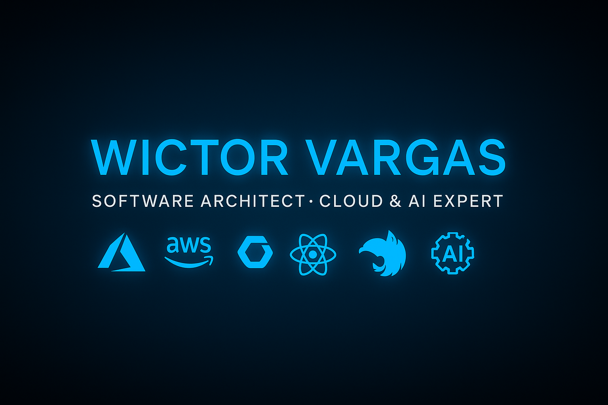

  

# 👋 Wictor Hugo Esteves Vargas  

### Computer Engineer • Software Architect • Cloud, DevOps & Blockchain Specialist  

> _“The right architecture turns complexity into clarity — and the impossible into scalable reality.”_  

---

📘 This README is available in **English** and **Portuguese**.  
👉 [🇧🇷 Ler em Português](./README.md)

---

# 🇺🇸 About

Software Architect and Cloud Engineer with over **12 years of experience** in **full-stack development, software architecture, DevOps, and cloud solutions**, with solid **experience in Artificial Intelligence and Blockchain**.  
Worked on complex corporate and public-sector projects, mastering **.NET, Node.js/NestJS, Angular, React, Next.js, Azure, and DevOps pipelines**.

---

## 🧠 Areas of Expertise

- **Software Architecture & Cloud Computing**  
- **Full-Stack Development (C#, TypeScript, Angular, React, Next.js, NestJS)**  
- **DevOps Automation (CI/CD, Docker, Kubernetes, Terraform, Azure DevOps, GitHub Actions)**  
- **Artificial Intelligence (Azure OpenAI, Vertex AI, Dialogflow CX, LangChain, RAG)**  
- **Blockchain & Smart Contracts (Security, Cryptography, Web3, Ethereum)**  
- **Security & Compliance (IAM, OWASP, Zero Trust, Cybersecurity)**  
- **Leadership & Management (XP, PMBOK, Scrum, Kanban)**  

---

## ⚙️ Software Engineering & Architecture

`SOLID` · `Clean Code` · `Design Patterns` · `DDD` · `TDD` · `BDD` ·  
`Clean Architecture` · `Onion Architecture` · `CQRS` · `Event-Driven Architecture`

---

## ☁️ Cloud & DevOps (Advanced)

### 🔹 Azure
`AI Search` · `Azure OpenAI` · `Functions` · `Cosmos DB` · `Blob Storage` · `Key Vault` · `App Service` ·  
`Application Insights` · `Log Analytics` · `AKS` · `Azure DevOps` · `Terraform` · `Bicep` · `Azure Policy` · `IAM`

### 🔹 AWS
`EC2` · `S3` · `ECS` · `EKS` · `Lambda` · `CloudFormation` · `IAM` · `CloudWatch` ·  
`SQS` · `SNS` · `API Gateway` · `CloudFront` · `DynamoDB` · `Route 53` · `Secrets Manager`

### 🔹 GCP
`Vertex AI` · `Dialogflow CX` · `Compute Engine` · `Cloud Run` · `Cloud Functions` ·  
`BigQuery` · `Cloud SQL` · `Firestore` · `Pub/Sub` · `IAM` · `Cloud Build` · `Operations Suite`

---

## 🧭 Leadership & Management

`Scrum` · `Kanban` · `XP (Extreme Programming)` · `PMBOK` ·  
`High-Performance Team Leadership` · `Project Management (PMI)`

---

## 📈 GitHub Stats

---

## 📫 Contact

📧 **wictorsama@gmail.com**  
💼 [linkedin.com/in/wictor-vargas](https://www.linkedin.com/in/wictor-vargas/)  
🌎 Portfolio (under development)

---

  
⭐️ _“The right architecture turns complexity into clarity — and the impossible into scalable reality.”_ ⭐️

